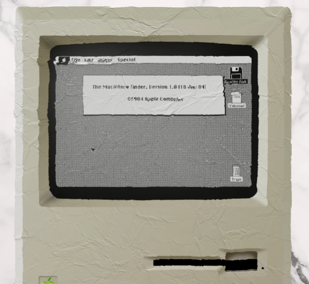
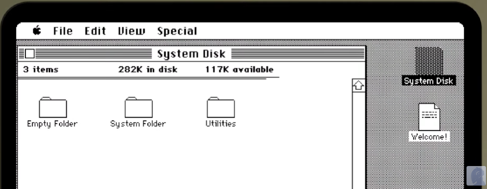
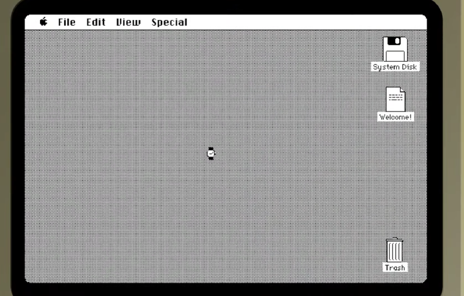

# **HIstoria de MacOS // Jorge Parra & Jose Holguin**

# 1984 -> Macintosh
> **Primer version de MacOS**  
>
- **Interfaz grafica** 
- **Inspiro Microsoft** 
- **La idea de un OS con GUI fue inspirado en la empresa XEROX // Steve Jobs** 
- **Su primera version tenia el nombre de "System"** 

  

# Interfaz Grafica
> **Explorador de archivos de MacOS // Finder**  
>
>   **Interfaz grafica de MacOS**  
>

- **Calculadora** 
- **Panel de control** 
- **Teclado virtual** 
- **Scrapbook // almacenar informacion** 
- **Notepad** 
- **AppleTalk** 
> 
 

#   Limitaciones
- **Poco almacenamiento** 
- **Poca memoria** 
- **1 programa a la vez**  
> 

#    Finder // Que es? 
> **Explorador de archivos de MacOS**  
> *Resumen:* 
> El Finder de macOS es la herramienta principal para organizar y ver archivos en una Mac. Es como la ventana principal para explorar y gestionar todos los archivos y carpetas en tu computadora. 
> 
 
- **Navegación de carpetas**
- **Vista previa de archivos**
- **Búsqueda avanzada**
- **Copiar, mover y eliminar**
- **Creación de carpetas y etiquetas**
- **Gestión de ventanas**

#    Archivos .dmg // Que son? 
> **Archivos .dmg de MacOS**  
> 
> *Resumen:* 
> Los archivos .dmg en macOS son como carpetas especiales que pueden contener aplicaciones o archivos. Cuando haces doble clic en un archivo .dmg, se abre como si fuera un disco virtual, y puedes acceder a su contenido. Son comunes para instalar programas en Mac y para distribuir archivos. También se pueden usar para hacer copias de seguridad y pueden estar protegidos con contraseña para mayor seguridad.
  
- **Almacenamiento de archivos**
- **Instalación de aplicaciones**
- **Seguridad**
- **Compresión opcional**
- **Protección con contraseña**

#    AirDrop // Que es? 
> **AirDrop en productos Apple**  
> 
> *Resumen:* 
> AirDrop es una característica de macOS (el sistema operativo de Apple para Mac) que te permite compartir archivos de forma inalámbrica con otros dispositivos Apple cercanos, como otros Mac, iPhones, iPads y iPods Touch, sin necesidad de utilizar correo electrónico o mensajes de texto. Aquí tienes una descripción más detallada de cómo funciona AirDrop en macOS:
  
- **Transferencia de archivos**
- **Conexión sin cables**
- **Configuración sencilla**
- **Compartir archivos**
- **Aceptar archivos**
- **Seguridad y privacidad**
- **Compatibilidad**
